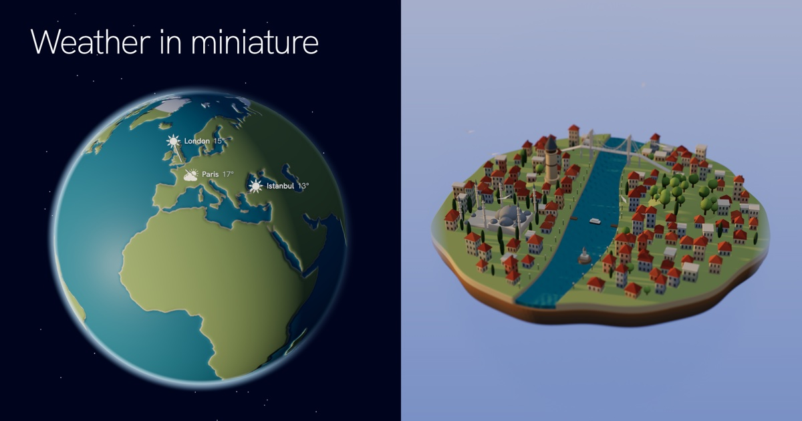

# Weather in miniature

Live weather in clay miniature: each city lit by its real sun and moon and dressed in its weather right now.

**[weather.arasmehmet.com](https://weather.arasmehmet.com)**



The page opens on a globe with the day and night where they really are and each city marked with an icon of its current weather and its temperature. Pick a city and the camera dives in to its floating island.

Each island follows its city:

- The sun and moon sit where they are in that sky, so the light, shadows, window lights and sky colours follow the local time.
- Clouds, rain, snow, fog, wind and lightning come from the current conditions.
- Smaller things come and go too. Chimneys smoke when it is cold. Gulls circle on clear days, and fireflies come out on warm nights. A rainbow can appear when light rain meets a low sun. The Eiffel Tower sparkles on the hour after dark, and Big Ben strikes the hour if sound is on.

## Running it

```sh
pnpm install
pnpm dev      # http://localhost:5181
pnpm build    # type-checks, then builds to dist/
```

Every island has its own address, e.g. `/#paris` or `/#new-york`. For development, a few query parameters override the live data:

| Parameter | Effect |
| --- | --- |
| `?w=clear` | Force the weather: `clear`, `overcast`, `rain`, `storm`, `snow`, `fog` or `rainbow` |
| `?shift=6` | Move the clock by some hours |
| `?temp=3` | Force the temperature the island reacts to |

## How it is made

- [three.js](https://threejs.org) renders the scene. Every island is built in code from rounded boxes, cones and lathes. Its parts are merged by material, so each island is drawn in a handful of draw calls.
- [SunCalc](https://github.com/mourner/suncalc) gives the positions of the sun and moon.
- [Open-Meteo](https://open-meteo.com) provides the current weather (CC BY 4.0).
- The globe's coastlines come from [Natural Earth](https://www.naturalearthdata.com) via [world-atlas](https://github.com/topojson/world-atlas). They are drawn with [d3-geo](https://github.com/d3/d3-geo).
- The ambient sound is synthesised in the browser with the Web Audio API.
- The hand-drawn icons are from [Koboyo](https://koboyo.com/icons).

## License

[MIT](LICENSE) © Aras Mehmet. The icons in `src/icons` are not covered by the MIT licence; they fall under [Koboyo's licence](https://koboyo.com/icons/license).
