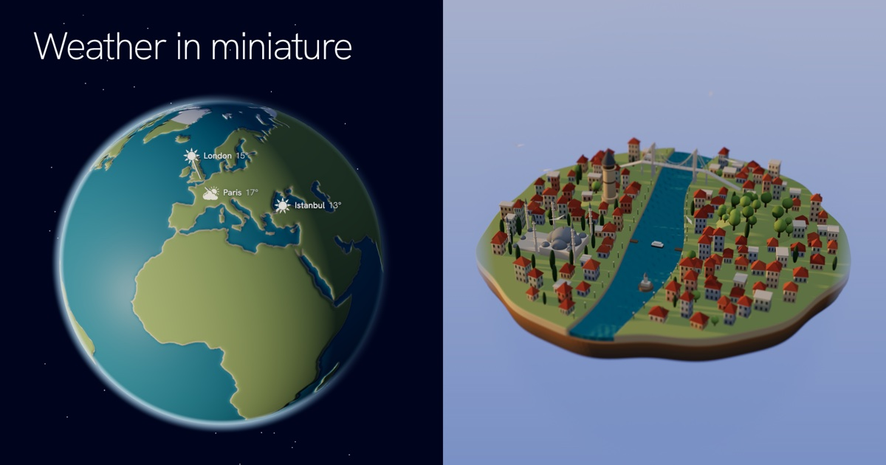

# Weather in miniature

Live weather in clay miniature: each city lit by its real sun and moon and dressed in its weather right now.

**[weather.arasmehmet.com](https://weather.arasmehmet.com)**



The page opens on a globe with the day and night where they really are and each city marked with an icon of its current weather and its temperature. Pick a city and the camera dives in to its floating island.

Each island follows its city:

- The sun and moon sit where they are in that sky, so the light, shadows, window lights and sky colours follow the local time.
- Clouds, rain, snow, fog, wind and lightning come from the current conditions.
- Smaller things come and go too. Chimneys smoke when it is cold. Gulls circle on clear days, and fireflies come out on warm nights. A rainbow can appear when light rain meets a low sun.
- Each city has touches of its own, listed below.

## The cities

From west to east, as the arrows step through them. Times are local.

| City | Touches |
| --- | --- |
| Honolulu | Surfers ride the waves off Waikiki; torches are lit along the beach at dusk. |
| San Francisco | A foghorn calls through the fog (with sound). |
| Mexico City | The flag over the Zócalo flies from 8:00 to 18:00; marigolds and candles ring the square for the Day of the Dead, 31 October to 2 November; jacarandas flower in March. |
| Chicago | The river turns green on the Saturday before St Patrick's Day. |
| New York | The Empire State Building's crown changes colour at night. |
| Rio de Janeiro | A cable car shuttles between Urca and Sugarloaf. |
| Reykjavik | Northern lights on clear, dark nights; the Imagine Peace Tower shines on its dates; snow lies on Esja from November to April. |
| London | Big Ben strikes the hour (with sound). |
| Paris | The Eiffel Tower sparkles for five minutes on the hour after dark. |
| Venice | St Mark's Square floods in autumn and winter storms. |
| Berlin | The sun draws a cross on the TV tower's ball; kites fly over Tempelhof on windy days. |
| Cape Town | Cloud pours over Table Mountain when the south-easter blows; the noon gun fires at 12:00 except on Sundays, with a boom if sound is on. |
| Istanbul | The bridge's cables change colour at night. |
| Giresun | Boats go round Giresun Island on 20 May for the Aksu festival; hazelnuts dry below the groves in August. |
| Dubai | The fountain dances at showtime; sand haze drifts in on windy, dry days. |
| Mumbai | The Queen's Necklace glows along Marine Drive at night; monsoon waves break over the sea wall on windy days. |
| Bangkok | Candlelit floats drift down the river on the November full moon. |
| Singapore | The Supertrees light up in colour for Garden Rhapsody at 19:45 and 20:45; the Merlion spouts into the bay. |
| Hong Kong | Lasers sweep from the rooftops from 20:00 to 20:10. |
| Tokyo | Tokyo Tower and Sensō-ji stand by the Sumida among cherry trees. |
| Sydney | Fireworks at 21:00 and midnight on New Year's Eve; jacarandas flower purple from mid-October through November. |
| Auckland | Yachts come out on breezy days; the pohutukawa along the shore flower red in December. |

## Running it

```sh
pnpm install
pnpm dev      # http://localhost:5181
pnpm build    # type-checks, then builds to dist/
```

Every island has its own address, e.g. `/#paris` or `/#new-york`. For development, a few query parameters override the live data:

| Parameter | Effect |
| --- | --- |
| `?w=clear` | Force the weather: `clear`, `overcast`, `rain`, `storm`, `snow`, `fog` or `rainbow` |
| `?shift=6` | Move the clock by some hours |
| `?temp=3` | Force the temperature the island reacts to |

## How it is made

- [three.js](https://threejs.org) renders the scene. Every island is built in code from rounded boxes, cones and lathes. Its parts are merged by material, so each island is drawn in a handful of draw calls.
- [SunCalc](https://github.com/mourner/suncalc) gives the positions of the sun and moon.
- [Open-Meteo](https://open-meteo.com) provides the current weather (CC BY 4.0).
- The globe's coastlines come from [Natural Earth](https://www.naturalearthdata.com) via [world-atlas](https://github.com/topojson/world-atlas). They are drawn with [d3-geo](https://github.com/d3/d3-geo).
- The ambient sound is synthesised in the browser with the Web Audio API.
- The hand-drawn icons are from [Koboyo](https://koboyo.com/icons).

## License

[MIT](LICENSE) © Aras Mehmet. The icons in `src/icons` are not covered by the MIT licence; they fall under [Koboyo's licence](https://koboyo.com/icons/license).
